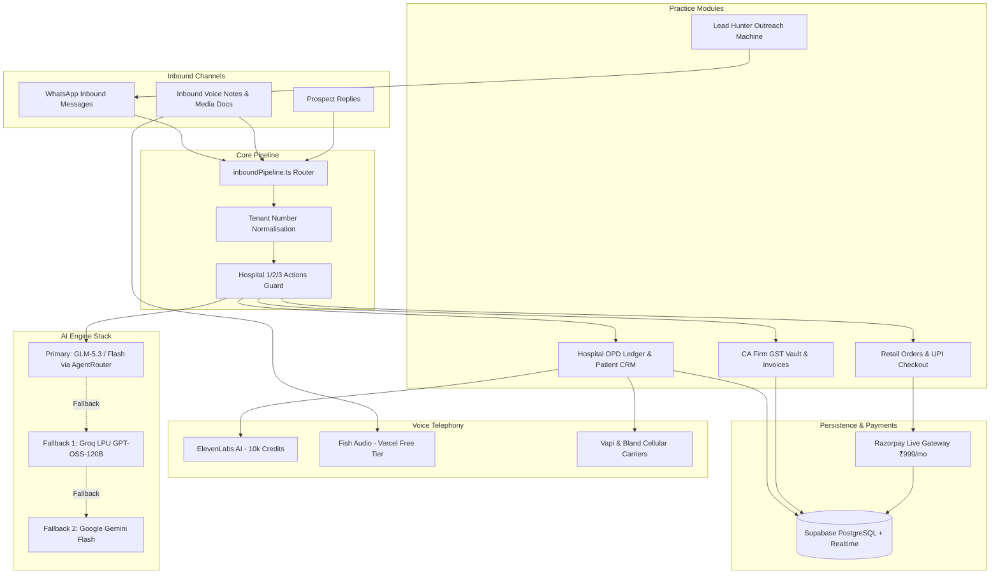

# 🚀 Agento AI (BizBot OS) — Complete Project Walkthrough & Technical Guide

> **An Autonomous, Multi-Tenant WhatsApp Commerce, Practice CRM & Voice AI Telephony Operating System for Indian Businesses.**

---

## 📑 Table of Contents

1. [Product Overview](#product-overview)
2. [System Architecture](#system-architecture)
3. [The 5 Core Vertical Modules](#the-5-core-vertical-modules)
   - [1. Hospital & Multi-Specialty OPD Engine](#1-hospital--multi-specialty-opd-engine)
   - [2. High-Definition Voice Telephony Suite (ElevenLabs + Fish Audio)](#2-high-definition-voice-telephony-suite)
   - [3. CA Firm & Tax Accounting Suite](#3-ca-firm--tax-accounting-suite)
   - [4. Retail, Cafe & Restaurant Commerce](#4-retail-cafe--restaurant-commerce)
   - [5. Lead Hunter: Automated Outreach Machine](#5-lead-hunter-automated-outreach-machine)
4. [Dual-Engine AI Intelligence Stack](#dual-engine-ai-intelligence-stack)
5. [Database Architecture & Supabase Tables](#database-architecture--supabase-tables)
6. [API Routes Directory](#api-routes-directory)
7. [Telephony & Payment Credentials](#telephony--payment-credentials)
8. [Quick Start & Launch Commands](#quick-start--launch-commands)

---

## 🌟 Product Overview

**Agento AI (BizBot OS)** replaces manual receptionists and front-desk staff with an autonomous AI assistant operating 24/7 on **Meta WhatsApp Cloud API** and **AI Voice Calling**.

It serves four distinct high-revenue Indian business verticals:
- **Hospitals & Clinics**: OPD consultations, token management, automated 24h/2h reminders, 1/2/3 confirmations, and post-visit reviews.
- **CA & Accounting Firms**: WhatsApp GST/PAN document upload vault, automated invoice OCR extraction, compliance reminders, and ITR quotes.
- **Cafes & Restaurants**: Hinglish conversational ordering, dynamic UPI Razorpay payment links, and kitchen order tickets.
- **Luxury Salons & Retail**: Appointment bookings, service selection, and instant confirmations.

---

## 🏛️ System Architecture



---

## 🧩 The 5 Core Vertical Modules

### 1. Hospital & Multi-Specialty OPD Engine

* **2-Way WhatsApp Booking**: Patients text naturally (*"Book cardiology consultation with Dr. Sarah Jenkins on 30 August at 2 PM"*).
- **Automated Token Assignment**: Generates sequential/random OPD tokens (`#1` to `#40`) with fee calculation (`₹800`).
- **Interactive 1 / 2 / 3 Reminder System** (`src/services/hospitalCronService.ts` & `src/services/inboundPipeline.ts`):
  - Automated cron scanners execute 24 hours and 2 hours prior to the appointment.
  - Sends: *"Reply 1 to Confirm, 2 to Reschedule, or 3 to Cancel."*
  - **Reply `1`** ➡️ Updates `status: 'confirmed'`, issues instant confirmation.
  - **Reply `2`** ➡️ Sets `rescheduled: true`, prompts AI for new date/time.
  - **Reply `3`** ➡️ Updates `status: 'cancelled'`, frees up the doctor slot.
- **Patient Health Directory**: EMR records, blood group profiles, emergency contacts, and complete WhatsApp interaction logs.

---

### 2. High-Definition Voice Telephony Suite

* **ElevenLabs AI (10,000 Credits Active)** (`src/services/elevenLabsService.ts`):
  - **Primary Voice Engine**: Configured with `sk_caefff...`.
  - Loaded with 21 studio-grade voices including **`Sarah`** (empathetic medical tone) and **`Roger`**.
  - Generates high-fidelity spoken audio files for WhatsApp voice notes and interactive calling.
- **Fish Audio AI (Vercel AI Gateway)** (`src/services/fishAudioService.ts`):
  - Free promotional tier with 8 models (`fish-audio/s2.1-pro-free`, `fish-audio/s2-pro-free`, `fish-audio/transcribe-1`).
  - Instant speech-to-text (STT) for incoming WhatsApp customer voice notes.
- **Vapi & Bland AI Telephony**: Direct cellular outbound dialer integration.

---

### 3. CA Firm & Tax Accounting Suite

* **WhatsApp Document Vault**: Clients take photos or send PDFs of PAN cards, GST invoices, and bank statements; extracted directly into structured JSON.
- **Automated GST & Compliance Reminders**: Automated cron alerts for GSTR-1, GSTR-3B, and advance tax deadlines.
- **Instant Tax Quotes**: Quotation builder for GST registration, ITR filing, and company incorporation.

---

### 4. Retail, Cafe & Restaurant Commerce

* **Hinglish Conversational Ordering**: Understands colloquial Indian texting (*"Bhai 2 cold brew aur ek truffle pasta Bandra bhej do"*).
- **Razorpay Payment Integration**:
  - Live API keys (`rzp_live_TQ8rV6...`).
  - Automatically calculates totals and sends dynamic UPI payment links.
  - Webhook listener verifies payments and sets status to `Paid & Preparing`.

---

### 5. Lead Hunter: Automated Outreach Machine

* **Local Business Scraper**: Searches and discovers targeted cafes, clinics, and CA firms from Google Places.
- **AI Copywriting Generator**: Automatically drafts high-converting WhatsApp pitches tailored to each business.
- **Automated 3-Step Sequences**: Tracks delivery, responses, and routes hot leads to the operator dashboard.

---

## 🧠 Dual-Engine AI Intelligence Stack

```
1. Primary Provider:  GLM-5.3-Flash / GLM-5.3 (via AgentRouter & Kira AI)
   • Ultra-low token cost, 1M context window, high Hinglish fluency.
2. Fallback Provider 1: Groq LPU (GPT-OSS-120B / Llama-3.3)
   • Sub-200ms ultra-fast inference for rapid customer texting.
3. Fallback Provider 2: Google Gemini Flash Latest
   • High-precision document OCR and multi-modal image reasoning.
```

---

## 🗄️ Database Architecture & Supabase Tables

| Table Name | Description | Key Columns |
| :--- | :--- | :--- |
| `businesses` | Multi-tenant tenant accounts | `id`, `name`, `category`, `whatsapp_number`, `subscription_status`, `trial_end_date` |
| `orders_bookings_leads` | Master capture ledger | `id`, `business_id`, `type`, `customer_number`, `details`, `status` |
| `hospital_appointments` | OPD consultations | `id`, `business_id`, `patient_name`, `doctor_name`, `department`, `slot_time`, `token_number`, `status` |
| `hospital_patients` | EMR directory | `id`, `business_id`, `name`, `phone`, `blood_group`, `status`, `last_visit` |
| `hospital_feedback` | Post-visit ratings | `id`, `appointment_id`, `rating`, `status`, `google_review_requested` |
| `hospital_voice_calls` | Telephony call records | `id`, `patient_name`, `patient_phone`, `call_type`, `outcome`, `duration_seconds` |
| `ca_clients` | Tax accounting clients | `id`, `business_id`, `client_name`, `phone`, `gstin`, `pan` |
| `ca_documents` | Uploaded receipts/docs | `id`, `client_id`, `document_type`, `file_url`, `status`, `extracted_data` |

---

## 📡 API Routes Directory

- **Hospital & Healthcare**:
  - `GET / POST / PUT` `/api/hospital/appointments` — OPD booking & status ledger
  - `GET / POST` `/api/hospital/patients` — Patient EMR health directory
  - `POST` `/api/hospital/voice-calls` — Trigger outbound AI voice calls
  - `GET` `/api/hospital/doctors` — Active physician roster
  - `POST` `/api/hospital/feedback` — Patient review scanner
- **CA Firm & Tax**:
  - `GET / POST` `/api/ca/clients` — Client roster
  - `GET / POST` `/api/ca/documents` — WhatsApp document vault & OCR
  - `POST` `/api/ca/leads/quote` — Dynamic service quotation builder
- **WhatsApp Webhooks & Core**:
  - `GET / POST` `/api/webhook` — Meta WhatsApp Cloud API webhook receiver
  - `POST` `/api/create-order` — Retail/Cafe order creation
  - `POST` `/api/verify-payment` — Razorpay payment verification
  - `GET / POST` `/api/admin/lead-hunter/*` — Lead discovery & pitch engine

---

## 🔑 Telephony & Payment Credentials

- **ElevenLabs AI**: Key `sk_caefff...` (10,000 verified credits, 21 studio voices)
- **Vercel AI Gateway (Fish Audio)**: Key `vck_27sNpO...` (Free promotional tier)
- **Razorpay Payment Gateway**: Live Key `rzp_live_TQ8rV6...` (`₹999/month` SaaS tier)
- **Meta WhatsApp Cloud API**: Number ID `946659075207120`

---

## 🚀 Quick Start & Launch Commands

### Development Server

```powershell
npm run dev
```

*Accessible at: `http://localhost:3000`*

### Production Build & Verification

```powershell
npx tsc --noEmit
npm run build
```

### Claude Code with AgentRouter (GLM-5.3)

```powershell
.\start-claude.bat
```

---

*Authored for WebCore Studios · Agento AI Platform v1.0.0*
